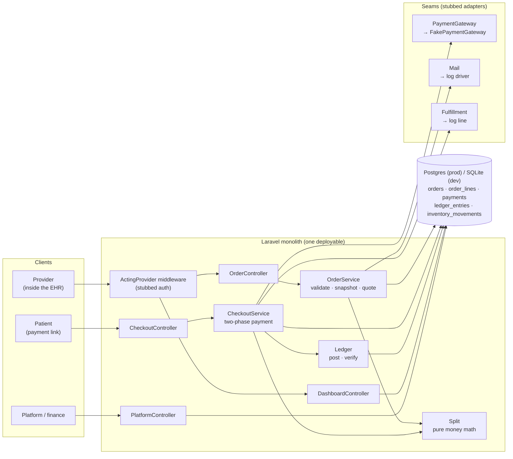
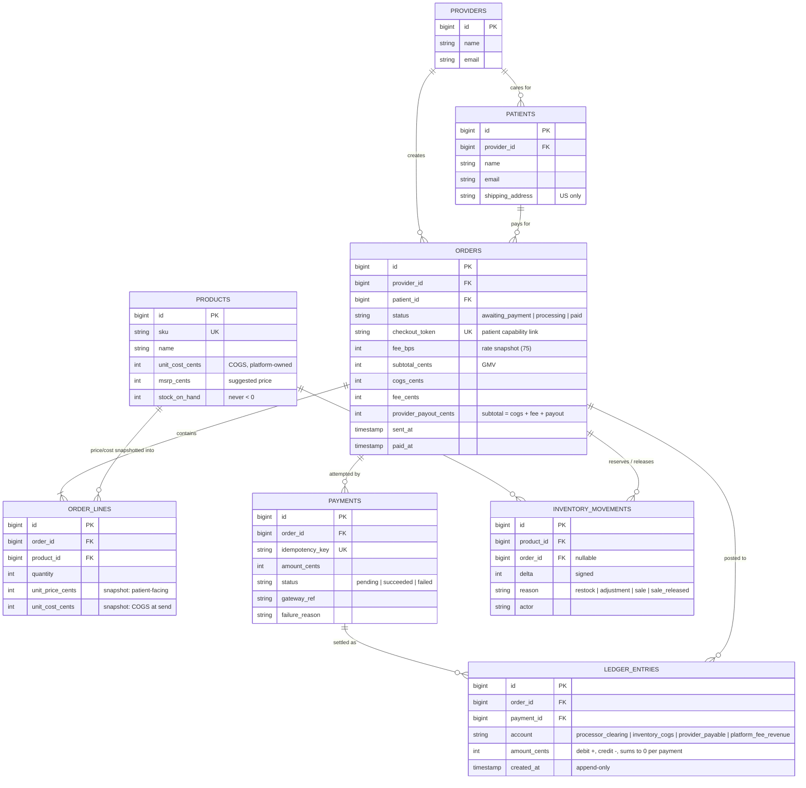
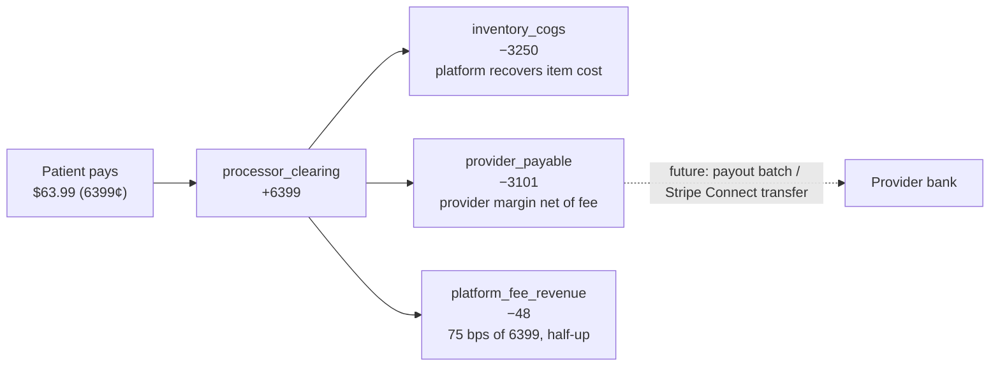
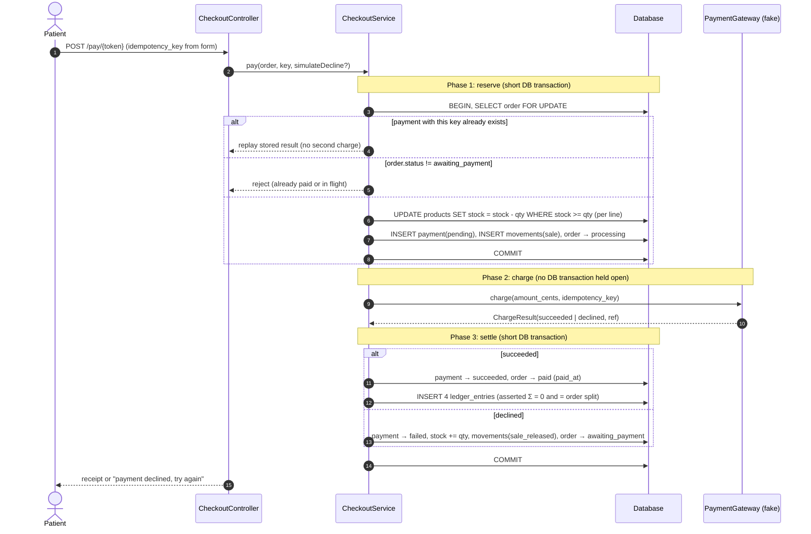
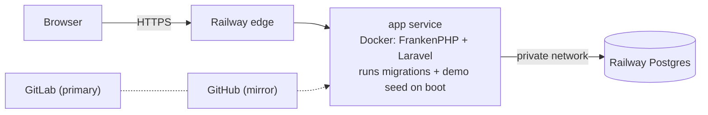

# System Design

How the slice is built and why. Product rules and assumptions are in [PRD.md](PRD.md); concepts and trade-offs are in [ARCHITECTURE.md](ARCHITECTURE.md). The raw Mermaid source for every diagram below is in [`diagrams/`](diagrams/) (one `.mmd` per diagram, ready to paste into [mermaid.live](https://mermaid.live)).

## Design goals, in priority order

1. **Money integrity.** Every paid order's cents are fully accounted for, reproducibly, with no floats, no drift, and no double charges.
2. **Clean seams.** Payments, auth, email, and fulfillment are stubbed behind boundaries a real adapter can drop into.
3. **Smallest thing that proves it.** One deployable, server-rendered pages, and a handful of tables. Breadth is deliberately cut.

## Key assumptions that shape the design

- **We are merchant of record and hold inventory.** The patient pays us, we keep COGS, owe the provider their margin, and earn 75 bps.
- **The fee is 75 bps of the order subtotal, once per order, rounded half-up, and borne by the provider.** The patient pays exactly the quoted price.
- **Quotes lock at send.** Unit price, unit cost, and fee rate are copied onto the order, so later catalog changes can't move a sent order's money.
- **Payment is the only external call in the critical path, and it is slow and unreliable in real life.** The design never holds a DB transaction open across it.

## 1. Architecture



<sub>Source: [`diagrams/architecture.mmd`](diagrams/architecture.mmd)</sub>

A **modular monolith**. Controllers stay thin. Two services own the domain (`OrderService` for quote and send, `CheckoutService` for pay). One pure class owns the money math (`Split`), and one owns the books (`Ledger`). Each external dependency sits behind a seam:

- **Payments:** a `PaymentGateway` interface bound to `FakePaymentGateway` in the service container.
- **Email:** Laravel's mail facade with the `log` driver.
- **Fulfillment:** a log line at the "order paid" point.
- **Auth:** `ActingProvider` middleware that resolves a provider from the session.

**Why a monolith:** one team, one transactional boundary around order, payment, inventory, and ledger. Splitting services here would turn the hardest correctness problem (atomic settlement) into a distributed-transaction problem for no benefit.

## 2. Data model



<sub>Source: [`diagrams/erd.mmd`](diagrams/erd.mmd)</sub>

| Table | Role | Integrity mechanism |
|---|---|---|
| `products` | Catalog plus platform-owned stock | `stock_on_hand` only changes via a conditional decrement (`WHERE stock_on_hand >= qty`). Postgres `CHECK (stock_on_hand >= 0)`. |
| `orders` | Header plus **persisted split** | Split columns written once from `Split`. Postgres `CHECK (subtotal = cogs + fee + payout)` and `CHECK (payout >= 0)`. |
| `order_lines` | **Snapshots** of price and cost at send | Never updated after send. Line math is derived (`qty × unit`), not stored twice. |
| `payments` | One row per attempt | `UNIQUE(idempotency_key)`. Partial unique index allows at most one `pending` or `succeeded` payment per order. |
| `ledger_entries` | Double-entry postings | Append-only (model refuses update and delete). Σ = 0 per payment, asserted before insert and re-verified by `ledger:verify`. |
| `inventory_movements` | Stock audit trail | Every stock change writes a signed movement. `ledger:verify` checks `stock_on_hand == Σ delta`. |

Why both persisted split columns on `orders` **and** ledger rows? The columns are the **quote** the provider agreed to at send time. The ledger is the **record of money that actually moved**. Keeping both and verifying they agree is the audit: if they ever disagree, something is wrong and `ledger:verify` says which order.

## 3. The money split



<sub>Source: [`diagrams/money-flow.mmd`](diagrams/money-flow.mmd)</sub>

```
subtotal = Σ qty × unit_price        cogs = Σ qty × unit_cost
fee      = ⌊(subtotal × 75 + 5000) / 10000⌋       # half-up, integer-only
payout   = subtotal − cogs − fee                  # residual → invariant holds by construction
```

The payout is computed as the **residual**, so `subtotal == cogs + fee + payout` can never be off by a cent, no matter how the fee rounds. All arithmetic is PHP 64-bit integer math (`intdiv`); no floats anywhere.

## 4. Payment flow (the core)



<sub>Source: [`diagrams/payment-sequence.mmd`](diagrams/payment-sequence.mmd)</sub>

**Three short phases, not one long transaction:**

1. **Reserve.** In one DB transaction: lock the order row, check its state, short-circuit on a replayed idempotency key, conditionally decrement stock for every line, insert a `pending` payment, and move the order to `processing`. Any failure (out of stock, already paid) rolls back everything.
2. **Charge.** Call the gateway with the **same idempotency key**, with no transaction open. Real processors take hundreds of ms to seconds; holding row locks across that would serialize checkout and risk lock timeouts.
3. **Settle.** In one DB transaction: on success, mark the payment and order paid and post the ledger. On decline, mark the payment failed, release stock (with compensating movements), and reopen the order for retry.

**Double-pay protections, layered:**

| Scenario | What stops it |
|---|---|
| Double-click or refresh (same form) | Same `idempotency_key` → stored result replayed, gateway not called again |
| Two tabs (different keys) | Row lock plus `status = awaiting_payment` check. The second request sees `processing` or `paid` and is rejected. |
| A bug that skips the above | Partial unique index: at most one `pending`/`succeeded` payment per order, enforced by the DB |
| Gateway retry | The gateway receives the idempotency key, as Stripe and others support |

**Known gap (documented, not built):** if the process dies between phase 2 and phase 3, the order stays in `processing` with a `pending` payment. The fix is a reconcile job that looks up `pending` payments older than N minutes and asks the gateway for the charge by idempotency key.

## 5. Order lifecycle

```mermaid
stateDiagram-v2
  [*] --> awaiting_payment: provider sends order<br/>(prices, costs, fee_bps snapshotted; link issued)
  awaiting_payment --> processing: patient pays<br/>(stock reserved, payment pending)
  processing --> paid: charge succeeded<br/>(ledger posted)
  processing --> awaiting_payment: charge declined<br/>(stock released, can retry)
  paid --> [*]
  note right of paid
    Next (out of scope): fulfilled, refunded (reversal entries), cancelled
  end note
```



<sub>Source: [`diagrams/order-state.mmd`](diagrams/order-state.mmd)</sub>

Transitions happen only inside `CheckoutService`. Each is guarded by the current status read under a row lock, so an order can't be paid twice or settled from the wrong state.

## 6. Auditability

- **Order audit page** (`/orders/{id}`): lines with snapshots, the persisted split, every payment attempt, ledger entries, inventory movements, and live checks (ledger balances, ledger matches split, payment = subtotal).
- **`php artisan ledger:verify`**: re-runs those checks for **every** paid order and the stock-vs-movements check for every product. It exits non-zero on any discrepancy, so it can run nightly or in CI.
- **Platform metrics** (`/platform`) are computed **from the ledger**, the same rows auditors would look at, so GMV and fee revenue can't drift from what was actually charged.

## 7. Deployment



<sub>Source: [`diagrams/deployment.mmd`](diagrams/deployment.mmd)</sub>

A single Docker image (FrankenPHP + Laravel) on Railway with managed Postgres. The container runs migrations and an idempotent demo seed on boot. Local dev and the default test run use SQLite (zero setup). The suite also runs against Postgres (`DB_CONNECTION=pgsql`) so the production engine's locks and constraints are exercised.
