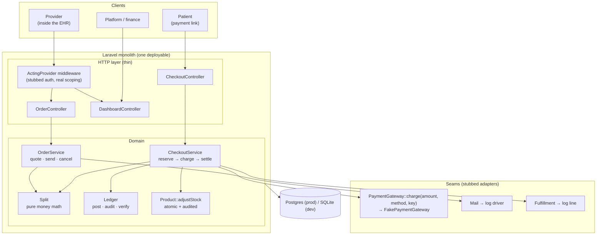
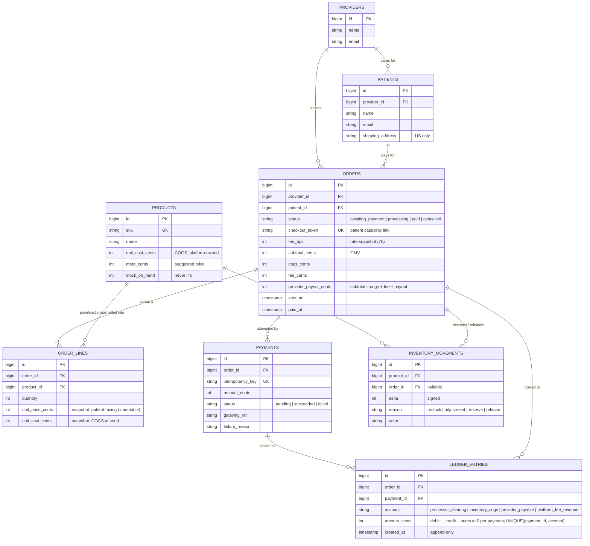
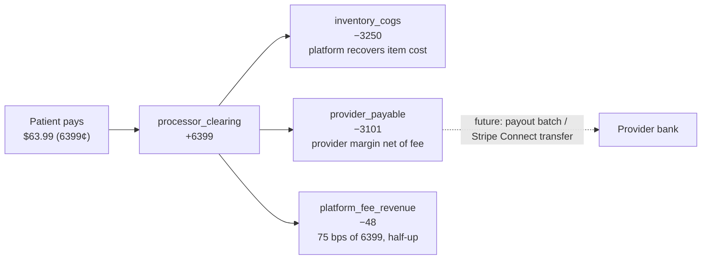
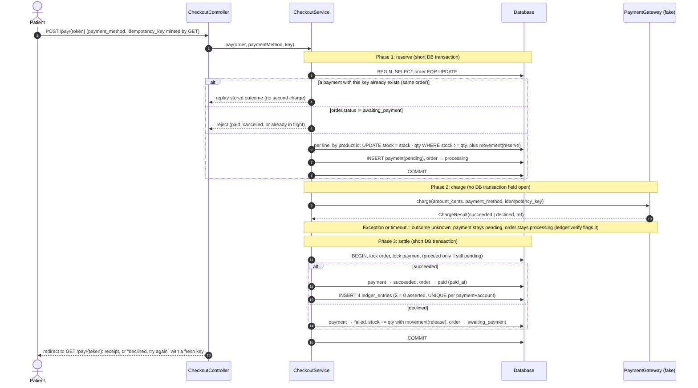
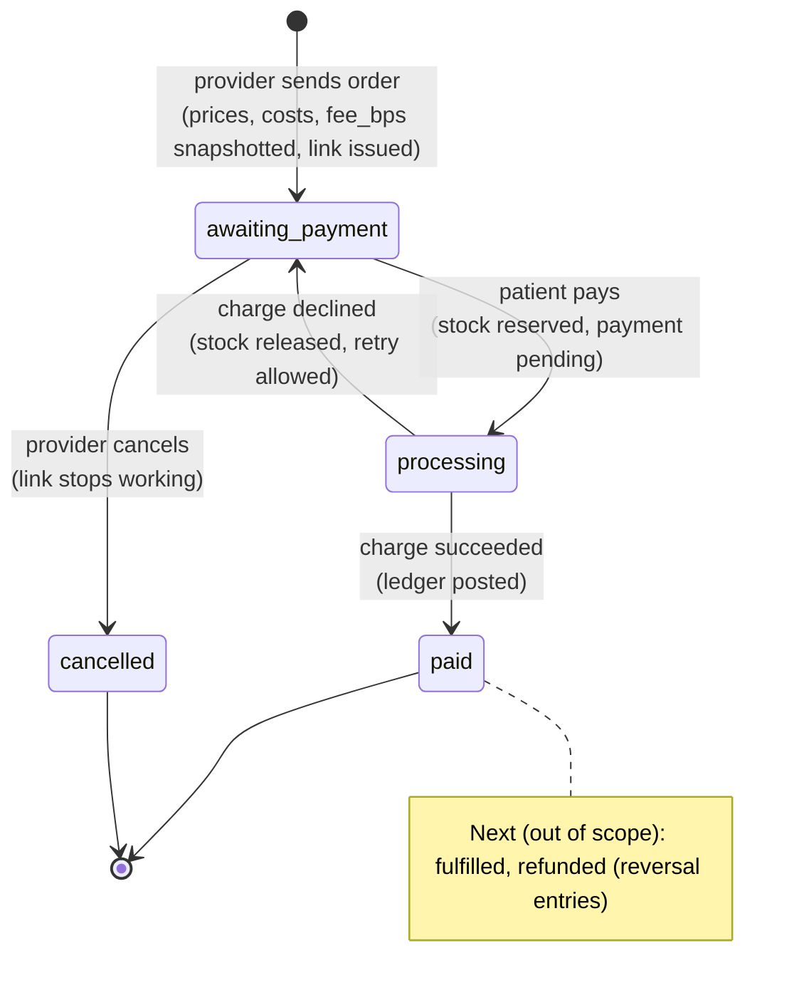
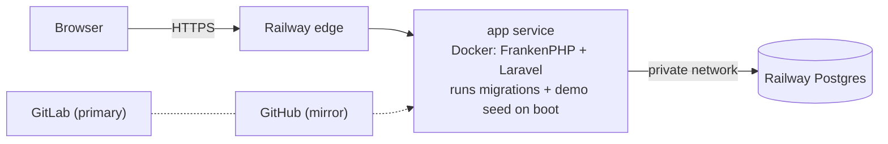

# System Design

How the slice is built and why. Product rules and assumptions are in [PRD.md](PRD.md); concepts and trade-offs are in [ARCHITECTURE.md](ARCHITECTURE.md). The raw Mermaid source for every diagram below is in [`diagrams/`](diagrams/) (one `.mmd` per diagram, ready to paste into [mermaid.live](https://mermaid.live)).

## Design goals, in priority order

1. **Money integrity.** Every paid order's cents are fully accounted for, reproducibly, with no floats, no drift, and no double charges.
2. **Clean seams.** Payments, auth, email, and fulfillment are stubbed behind boundaries a real adapter can drop into.
3. **Smallest thing that proves it.** One deployable, server-rendered pages, and a handful of tables. Breadth is deliberately cut.

## Key assumptions that shape the design

- **We are merchant of record and hold inventory.** The patient pays us, we keep COGS, owe the provider their margin, and earn 75 bps.
- **The fee is `fee_bps` (75 today) of the order subtotal, once per order, rounded half-up, and borne by the provider.** The patient pays exactly the quoted price.
- **Quotes lock at send.** Unit price, unit cost, and fee rate are copied onto the order, so later catalog changes can't move a sent order's money.
- **Payment is the only external call in the critical path, and it is slow and unreliable in real life.** The design never holds a DB transaction open across it.

## 1. Architecture



<sub>Source: [`diagrams/architecture.mmd`](diagrams/architecture.mmd)</sub>

A **modular monolith**. Controllers stay thin. Two services own the domain (`OrderService` for quote, send, and cancel, `CheckoutService` for pay). One pure class owns the money math (`Split`), one owns the books (`Ledger`), and one method owns stock (`Product::adjustStock`). Each external dependency sits behind a seam:

- **Payments:** a `PaymentGateway::charge(amountCents, paymentMethod, idempotencyKey)` interface bound to `FakePaymentGateway` in the service container. Simulating a decline is just a different `paymentMethod` value, as with Stripe's test payment methods, so no test-only flag leaks into the domain.
- **Email:** Laravel's mail facade with the `log` driver.
- **Fulfillment:** a log line at the "order paid" point.
- **Auth:** `ActingProvider` middleware that resolves a provider from the session.

**Why a monolith:** one team, one transactional boundary around order, payment, inventory, and ledger. Splitting services here would turn the hardest correctness problem (atomic settlement) into a distributed-transaction problem for no benefit.

## 2. Data model



<sub>Source: [`diagrams/erd.mmd`](diagrams/erd.mmd)</sub>

| Table | Role | Integrity mechanism |
|---|---|---|
| `products` | Catalog plus platform-owned stock | Stock changes **only** through `Product::adjustStock()`: one atomic relative `UPDATE` plus an audit movement in the same transaction. Decrements are conditional (`WHERE stock_on_hand >= qty`, affected rows checked), so stock can't go negative. Postgres also has `CHECK (stock_on_hand >= 0)`. |
| `orders` | Header plus **persisted split** | Split columns written once from `Split`. Postgres `CHECK (subtotal = cogs + fee + payout)` and `CHECK (payout >= 0)`. |
| `order_lines` | **Snapshots** of price and cost at send | Model refuses update and delete. Line math is derived (`qty × unit`), not stored twice. The audit recomputes the split from these lines. |
| `payments` | One row per attempt | `UNIQUE(idempotency_key)`. Partial unique index allows at most one `pending` or `succeeded` payment per order. |
| `ledger_entries` | Double-entry postings | Append-only (model refuses update and delete). `UNIQUE(payment_id, account)`, so a payment can't be posted twice. Σ = 0 per payment, asserted before insert and re-verified by `ledger:verify`. |
| `inventory_movements` | Stock audit trail | Every stock change writes a signed movement (`restock`, `adjustment`, `reserve`, `release`). `ledger:verify` checks `stock_on_hand == Σ delta`. |

Why both persisted split columns on `orders` **and** ledger rows? The columns are the **quote** the provider agreed to at send time. The ledger is the **record of money that actually moved**. The audit cross-checks these records against each other:

1. It recomputes the split from the immutable line snapshots and the order's `fee_bps`, and compares that to the stored quote.
2. It compares the ledger to the quote, account by account.
3. It checks for exactly one succeeded payment, equal to the subtotal.
4. For each product, the order's net stock movements must equal its lines while stock is reserved or sold, and must be zero otherwise.
5. An unpaid order must have no captured payment and no ledger rows. This is what catches money that was charged but never booked.

If any check disagrees, `ledger:verify` names the order and the check that failed.

**Limit:** the recomputation uses the same `Split` code and the order's own `fee_bps`. It catches corrupted *data*, such as an edited column, a tampered line, or a skipped posting. It does not catch a bug *in* `Split` itself. That's what the unit tests and the random-cart rounding oracle are for. A fee-rate schedule to validate `fee_bps` against is listed as next.

## 3. The money split



<sub>Source: [`diagrams/money-flow.mmd`](diagrams/money-flow.mmd)</sub>

```
subtotal = Σ qty × unit_price        cogs = Σ qty × unit_cost
fee      = ⌊(subtotal × fee_bps + 5000) / 10000⌋  # half-up, integer-only; fee_bps = 75, snapshotted per order
payout   = subtotal − cogs − fee                  # residual → invariant holds by construction
```

The payout is computed as the **residual**, so `subtotal == cogs + fee + payout` can never be off by a cent, no matter how the fee rounds. All arithmetic is PHP 64-bit integer math (`intdiv`) on `bigint` columns, with no floats anywhere. Prices enter as text and are parsed by a strict grammar (`^\$?\d{1,5}(\.\d{1,2})?$`, so at most $99,999.99) straight into cents. A unit test checks the invariant, and the fee against an independent rounding oracle, across 5,000 random carts.

## 4. Payment flow (the core)



<sub>Source: [`diagrams/payment-sequence.mmd`](diagrams/payment-sequence.mmd)</sub>

**Three short phases, not one long transaction:**

1. **Reserve.** In one DB transaction: lock the order row, check its state, short-circuit on a replayed idempotency key, conditionally decrement stock for every line, insert a `pending` payment, and move the order to `processing`. Any failure (out of stock, already paid) rolls back everything.
2. **Charge.** Call the gateway with the **same idempotency key**, with no transaction open. Real processors take hundreds of ms to seconds; holding row locks across that would serialize checkout and risk lock timeouts.
3. **Settle.** In one DB transaction: on success, mark the payment and order paid and post the ledger. On decline, mark the payment failed, release stock (with compensating movements), and reopen the order for retry.

**Idempotency key lifecycle.** One key = one payment attempt:

- `GET /pay/{token}` mints a fresh UUID into the form on every render.
- Every `POST` (success, decline, or rejection) redirects back to that `GET` (post/redirect/get), so a retry after a decline carries a new key.
- A re-submitted key (double-click, refresh of the POST) replays the stored outcome, *including a decline*. So a double-click on a declined card never fires a second charge.
- Keys are `UNIQUE` globally, and a key that belongs to another order is rejected.

**Double-pay protections, layered:**

| Scenario | What stops it |
|---|---|
| Double-click or refresh (same form) | Same `idempotency_key` → stored result replayed, gateway not called again |
| Two tabs (different keys) | Row lock plus `status = awaiting_payment` check. The second request sees `processing` or `paid` and is rejected. |
| A bug that skips the above | Partial unique index: at most one `pending`/`succeeded` payment per order, enforced by the DB |
| Gateway retry | The gateway receives the idempotency key, as Stripe and others support |

**Gateway contract.** `declined` means a definitive decline only. An exception or timeout means the outcome is *unknown*. In that case it propagates, and the payment stays `pending` with the order in `processing`. It is never mapped to "declined", because releasing stock for a charge that actually went through is worse than waiting.

**Known gap (detected, not auto-fixed):** the same `pending`/`processing` state results if the process dies between phase 2 and phase 3. `ledger:verify` flags any payment `pending` for more than 15 minutes. The fix is a reconcile job that asks the gateway for the charge by idempotency key and runs the normal settle step.

## 5. Order lifecycle



<sub>Source: [`diagrams/order-state.mmd`](diagrams/order-state.mmd)</sub>

Transitions happen only inside `CheckoutService` and `OrderService::cancel`. Each is guarded by the current status read under the same order row lock, so an order can't be paid twice, settled from the wrong state, or cancelled while a payment is in flight. Lock order: the order row is always locked first. Products are touched in ascending id order. In settle, the payment row is locked before stock is released. A payment belongs to exactly one order, and the order lock serializes everything per order, so two checkouts can't deadlock.

## 6. Auditability

- **Order audit page** (`/orders/{id}`): lines with snapshots, the persisted split, every payment attempt, ledger entries, inventory movements, and the live checks listed in §2.
- **`php artisan ledger:verify`** re-runs those checks for **every** order. It also checks:
  - the whole ledger sums to zero;
  - every product's `stock_on_hand` equals the sum of its movements;
  - no payment has been `pending` for more than 15 minutes.

  It reads inside one transaction (`REPEATABLE READ` on Postgres), so a checkout committing mid-audit can't cause a false alarm. It exits non-zero on any discrepancy, so it can run nightly or in CI.
- **Platform metrics** (`/platform`) are computed **from the ledger**, the same rows auditors would look at, so GMV and fee revenue can't drift from what was actually charged.

## 7. Deployment



<sub>Source: [`diagrams/deployment.mmd`](diagrams/deployment.mmd)</sub>

A single Docker image (FrankenPHP + Laravel) runs on Railway with managed Postgres.

**On boot,** the container runs migrations and then the demo seed. The seed is a no-op unless the DB is empty. It creates stock, orders, and payments through the real services, so the demo data passes `ledger:verify` like live data.

**Production settings:**
- `APP_ENV=production` and `APP_DEBUG=false`.
- `APP_KEY` lives only in Railway variables.
- Trusted proxies for `X-Forwarded-Proto`/`-For` only, because Railway terminates TLS at its edge and payment links must be `https`. `X-Forwarded-Host` is deliberately *not* trusted, because a forged header could otherwise choose the domain of the emailed payment link.
- `SESSION_SECURE_COOKIE=true`.

**Engines.** Local dev and the default test run use SQLite (zero setup). The suite also runs unchanged against Postgres (`DB_CONNECTION=pgsql …`), which exercises the production engine's CHECK constraints and partial unique index.

**What PHPUnit doesn't cover.** Race guards are tested *deterministically* in PHPUnit, because a single-process test can't create lock contention. The deterministic tests cover:
- a pay attempt against an order already `processing` is rejected with no side effects;
- a second live payment row is rejected by the database index;
- a replayed key is never charged twice.

Real contention is exercised separately by `scripts/race-check.sh`, which runs concurrent requests against Postgres with 8 PHP workers:
- 8 simultaneous payments for one order → 1 payment row, 1 ledger posting.
- 6 simultaneous payments for 4 units of stock → exactly 4 paid, stock 0, `ledger:verify` OK.
